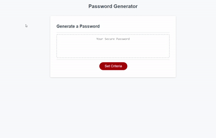

# Password Generator

## Table of Contents

- [Description](#Description)
- [Built With](#Built-With)
- [Screenshot](#Screenshot)
- [Credits](#credits)
- [License](#license)

## Description

A random password generator with a drop down menu to select criteria from. The page features checkbox elements to select lowercase, uppercase, numbers, or special characters for your password. The menu also features a password length input box wherein the criteria for a password between 8 and 128 can be entered. If a number above or below that range is entered, or the user does not choose at least one criteria for characters in their password, the 'Generate Password' button does not activate. 

## Built With

 - HTML
 - CSS
 - JavaScript

## Screenshot

    

## Credits
Callan Keesling 
Xandromus (Starter Code)

## License

MIT License

Copyright (c) [2022] [Callan-Keesling]

Permission is hereby granted, free of charge, to any person obtaining a copy
of this software and associated documentation files (the "Software"), to deal
in the Software without restriction, including without limitation the rights
to use, copy, modify, merge, publish, distribute, sublicense, and/or sell
copies of the Software, and to permit persons to whom the Software is
furnished to do so, subject to the following conditions:

The above copyright notice and this permission notice shall be included in all
copies or substantial portions of the Software.

THE SOFTWARE IS PROVIDED "AS IS", WITHOUT WARRANTY OF ANY KIND, EXPRESS OR
IMPLIED, INCLUDING BUT NOT LIMITED TO THE WARRANTIES OF MERCHANTABILITY,
FITNESS FOR A PARTICULAR PURPOSE AND NONINFRINGEMENT. IN NO EVENT SHALL THE
AUTHORS OR COPYRIGHT HOLDERS BE LIABLE FOR ANY CLAIM, DAMAGES OR OTHER
LIABILITY, WHETHER IN AN ACTION OF CONTRACT, TORT OR OTHERWISE, ARISING FROM,
OUT OF OR IN CONNECTION WITH THE SOFTWARE OR THE USE OR OTHER DEALINGS IN THE
SOFTWARE.
